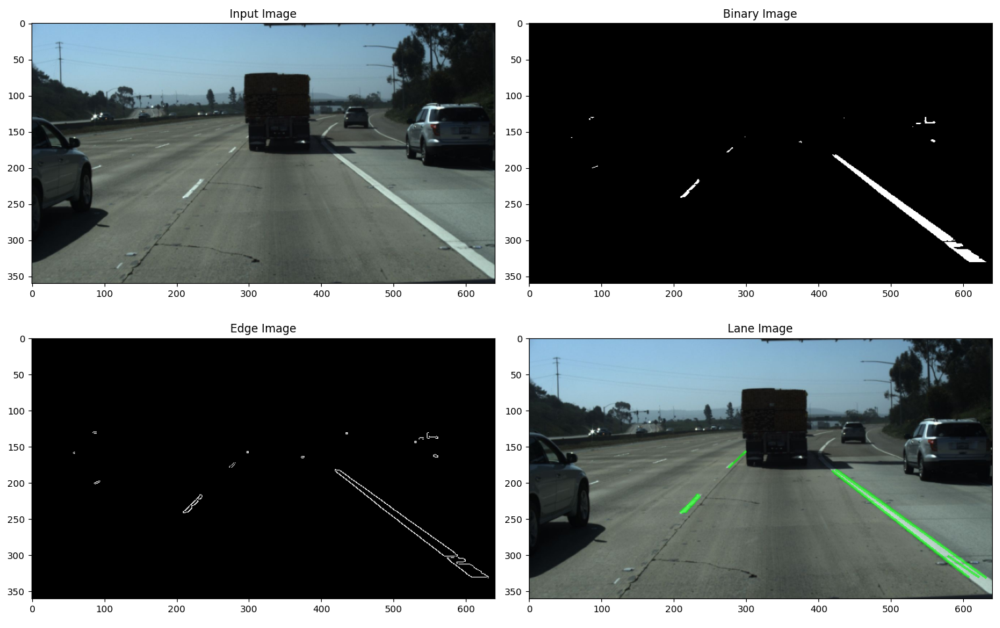

# Lane Detection

<p align="center">
  
</p>

A Python package for lane detection with support for two standard lane detection datasets in [`CULane`](https://www.kaggle.com/datasets/manideep1108/culane) and [`TuSimple`](https://www.kaggle.com/datasets/manideep1108/tusimple) and implementations of two lane detectors.
The first detector is a classical Computer Vision-based lane detector based on the probabalistic Hough line transform using OpenCV.
Meanwhile, the second approach uses the Spatial CNN (SCNN) architecture to train a segmentation model that predicts a full lane segmentation mask for the whole image.
The SCNN approach was first proposed in the paper titled: [`Spatial As Deep: Spatial CNN for Traffic Scene Understanding`](https://arxiv.org/abs/1712.06080).
SCNN's implementation is written fully using the **`JAX`** ecosystem with the use of the core JAX library, Flax, Optax and Orbax. 


## Table of Contents

* [Installation Instructions](#installation-instructions)
* [Spatial CNN Summary](#behavior-transformer-summary)
    * [Motivation and Overview](#motivation-and-overview)
    * [Message Passing Mechanism](#action-binning-encoding-and-decoding)
* [Package Summary](#package-summary)
* [Examples](#examples)
* [References](#references)


## Installation Instructions

This package can either be installed within the local Python environment or using a virtual one. Regardless of the installation method of choice, first clone this repository locally and navigate to its directory:
```bash
git clone https://github.com/Sherif-Sameh/LaneDetection.git
cd /path/to/LaneDetection/repository
```

### Virtual Environment using Pixi (recommended)

The recommended installation method is to install inside a Python virtual environment using the [`Pixi`](https://pixi.sh/latest/) package management tool.
Firstly, install Pixi on Linux/macOS using the following command.
```bash
curl -fsSL https://pixi.sh/install.sh | sh
```

Then, to setup the virtual environment and install all package dependencies, simply run the following command inside the directory of the `LaneDetection` repository.
```bash
pixi install
```

After installation, run the following command to start an interactive bash session inside the virtual environment.
```bash
pixi shell
```

### Local Environment using Pip
If you want to install the package inside your local Python environment or an existing virtual environment, simply run the following command inside the directory of the `LaneDetection` repository.
```bash
pip install .
```


## Spatial CNN Summary

This section provides a summary of the motivation and main idea behind the SCNN architecture.

### Motivation and Overview

Conventional CNNs are limited by their inherently local receptive fields—each convolution aggregates information only within a small spatial neighborhood.
This is suboptimal for tasks like **lane detection**, where structures of interest (lanes) are typically **long, continuous, and thin** across the image.
To capture such elongated dependencies, one would ideally want a receptive field that is **very long in one direction** while remaining narrow in the lane's perpendicular direction.
Simply stacking convolutions increases the receptive field only slowly and inefficiently, and employing global attention mechanisms would be **computationally prohibitive**, as every pixel would need to attend to every other pixel in the feature map.

SCNN addresses this by introducing an efficient **message passing mechanism** along spatial dimensions—propagating information **row- or column-wise** across the feature map in four directions (top-to-bottom, bottom-to-top, left-to-right, and right-to-left).
This effectively allows each pixel to indirectly receive information from all others without the quadratic cost of attention.
Importantly, this propagation is applied to the **final feature maps** of the CNN backbone, where the spatial resolution is lower and the features are semantically richer; thus greatly improving efficiency while maintaining strong contextual reasoning.

### Message Passing Mechanism

Each SCNN layer can be viewed as applying a **recurrent neural network (RNN)** along one spatial dimension, where the “temporal” axis corresponds to the direction of message passing.
For example, during vertical top-to-bottom propagation, each row updates its features based on the previously updated row above it.
A residual connection is used to stabilize training and prevent vanishing gradients.
Formally, for a feature map $\mathbf{X} \in \mathbb{R}^{H \times W \times C}$, the update rule for the $i$-th row in a top-to-bottom pass can be written as:

$$
\mathbf{X}^{\prime}_i = \mathbf{X}_i + f\left(\mathbf{K}_{ms} \ast \mathbf{X}_{i-1} \right),
$$

where $\mathbf{X}_i$ and $\mathbf{X}_{i-1}$ denote the the $i$-th and $(i-1)$-th rows of the feature map respectively, $\mathbf{K}_{ms}$ is the learned 1D convolutional kernel of the message passing layer and $f(\cdot)$ is a non-linear activation function, typically a ReLU activation.
For the top-to-bottom pass, this operation would be applied to all rows except the first since it has nothing before it to attend to.
However, during the opposite bottom-to-top pass, the first row recieves information propgated from all other rows in the feature map.  


## Package Summary

This section provides a summary of the main modules and sub-modules in this Python package.

* [`datasets`](lane_detection/datasets): The datasets module defines a standard interface lane detection datasets. It provides two dataset implementations for downloading, processing and loading of the `CULane` and `TuSimple` datasets. Both datasets are downloaded from **Kaggle**, processed and stored using the **H5py** package and load samples as **NumPy** arrays.

* [`dataloaders`](lane_detection/dataloaders): The dataloaders defines a standard interface for dataloaders based on the lane detection dataset interface. It provides a **NumPy**-based dataloader implementation that can be used for any lane detection dataset.

* [`transforms`](lane_detection/transforms): The transforms module defines a standard interface for pure **dataclass**-based image transformations similar to the torchvision interface. It provides implementations of multiple standard image transforms, all fully **JAX-JiT compatible**, based on Flax's [`dataclasses`](https://flax.readthedocs.io/en/stable/api_reference/flax.struct.html).

* [`models`](lane_detection/models): The models module contains two main **Flax NNX** model implementations. The first is an implementation of the full **VGG** family of models, with the ability to initialize their weights from their ImageNet **pre-trained weights** by translating them from the PyTorch to Flax NNX format. Secondly, there's the **SCNN** model implementation which uses a VGG backbone, with **JiT-compiled message passing** mechanisms.

* [`trainers`](lane_detection/trainers): The trainers module defines a standard interface that a trainer for a Flax NNX module must follow. The module provides an implementation of a **trainer for the SCNN** model for lane detection.

* [`detectors`](lane_detection/detectors): The detectors module defines a standard interface for lane detectors regardless of their detection method. It provides an **OpenCV-based** classical CV detector and a Flax-based **SCNN** detector.

* [`utils`](lane_detection/utils): The utils module provides several helpful functions that are needed sporadically throughout the package.


## Examples

Several demonstration scripts using the various modules in the package are given inside the [`examples`](examples) directory.

The [`datasets`](examples/datasets) directory provides two example scripts for downloading, coverting and loading a set of samples for the [`CULane`](examples/datasets/load_culane.py) and [`TuSimple`](examples/datasets/load_tusimple.py) datasets.
Additonally, inside the [`dataloaders`](examples/dataloaders) directory, you can find corresponding example scripts for initializing dataloaders for both datasets.

An example of initializing a **VGG** CNN model for image classification, then loading its **pre-trained ImageNet** and applying it to classify two sample images from the ImageNet classes can be seen inside the [`models`](examples/models) directory.

To train a SCNN model using the VGG-11 backbone, execute the following command inside the directory of the `LaneDetection` repository to run the example training script.

```bash
python examples/trainers/train_scnn.py
```

The [`train_scnn.py`](examples/trainers/train_scnn.py) script will train a SCNN-based lane detection model using the CULane dataset according to the configuration defined inside the [`scnn.toml`](examples/trainers/configs/scnn.toml) file.

Lastly, the [`detectors`](examples/detectors) directory provides two scripts for performing lane detection using both detectors.

```bash
python examples/detectors/classical_tusimple.py
```

```bash
python examples/detectors/scnn_culane.py
```

The [`classical_tusimple.py`](examples/detectors/classical_tusimple.py) applies the classical CV-based detector to a few sample images from the TuSimple dataset and display their final predicitions as well as intermediate outputs as shown below.

<p align="center">
  
</p>

The [`scnn_culane.py`](examples/detectors/scnn_culane.py) applies the SCNN-based detector to the full testing CULane dataset and records a video comparing the model's lane predictions to the ground truth labels as shown in the [`GIF`](images/scnn.gif) above.  **Important**: This script should obviously be run after training the SCNN model or after downloading the pre-trained weights from [`here`](https://drive.google.com/drive/folders/1NlT6E9yVLxpJP-4PyhDQwG2E64lsGz7j?usp=sharing) and storing them inside the [`weights`](lane_detection/models/weights) directory.